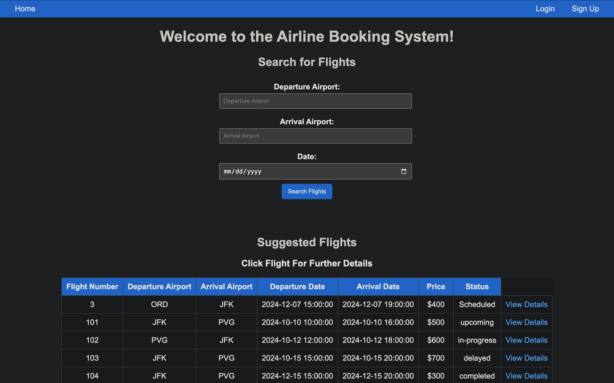
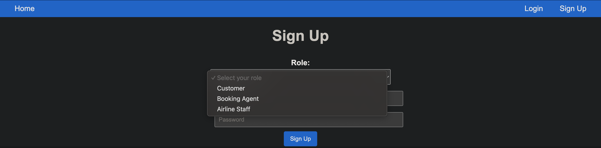
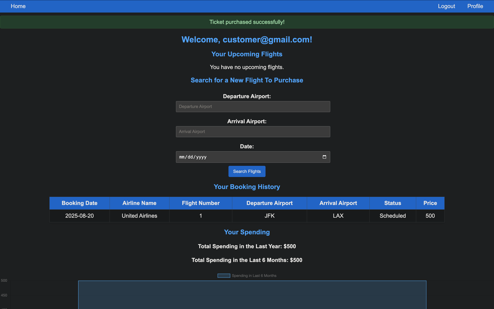
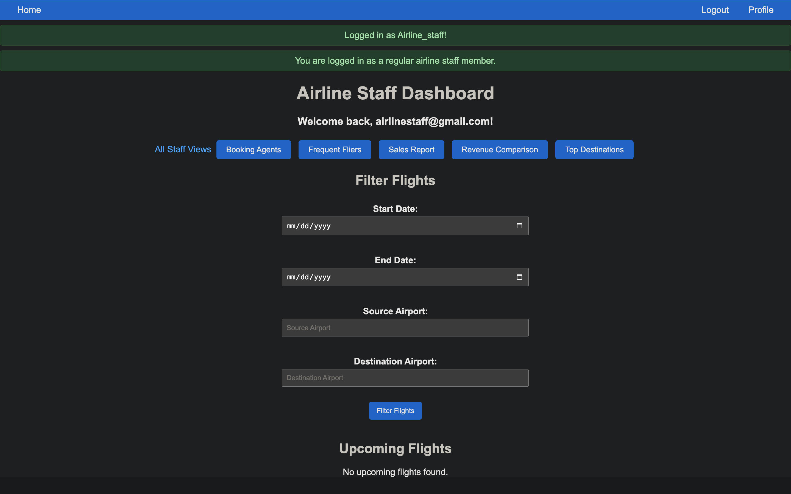

# SkyReserve

This project is a **full-stack web application** simulating a real-world airline ticket reservation system. Customers can search for flights, purchase tickets, track spending, and view dashboards, while airline staff and booking agents manage flights, airplanes, airports, and revenue reporting.  

## Quick Start
Demo Login ()
- Customer → customer@demo.com
- Staff Operator (China Eastern) → operator@demo.com
- Password: demo1234

---

## Technical Stack

- **Backend:** Python, Flask,  MySQL
- **Frontend:** HTML, CSS, JavaScript, Chart.js

---

## Features

### Homepage

- Guests can search and filter flights by date, origin, destination, and airline.

- Users can choose to login or sign-up as a customer, agent, or staff.

### Customer

- Purchase tickets and track personal spending.
- View interactive dashboards showing monthly and yearly spending.

### Booking Agent
- Purchase tickets on behalf of customers for their affiliated airline.
- View upcoming flights purchased for customers.
- Track commission earned from sales.

### Airline Staff

- Add and manage flights, airplanes, and airports.
- Access revenue comparison dashboards (direct vs indirect sales).
- View reports on ticket sales and customer activity.

### Admin
- Role-based access control for all users.
- Monitor system-wide metrics and data integrity.

---

## Getting Started (Local Setup)

### Clone the repository
```bash
git clone https://github.com/your-username/airline-ticket-reservation.git
cd airline-ticket-reservation
```

How To Run It On Your Own Computer
1. Download XAMPP and start Apache and MySQL
2. Go to http://localhost/phpmyadmin and import the given database
3. Download repository from github 
4. Run the following commands in the terminal

```bash
python3 -m venv venv
source .venv/bin/activate
pip install -r requirements.txt
python app.py (or python3 app.py)
```