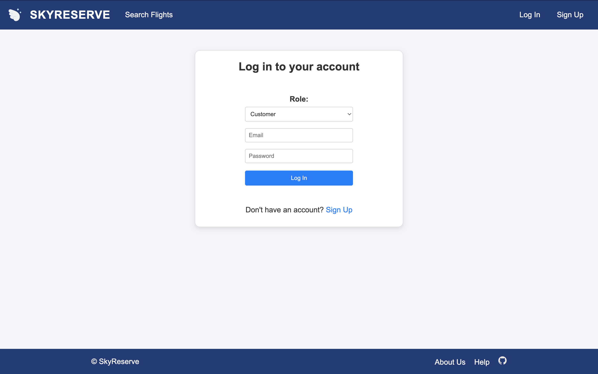
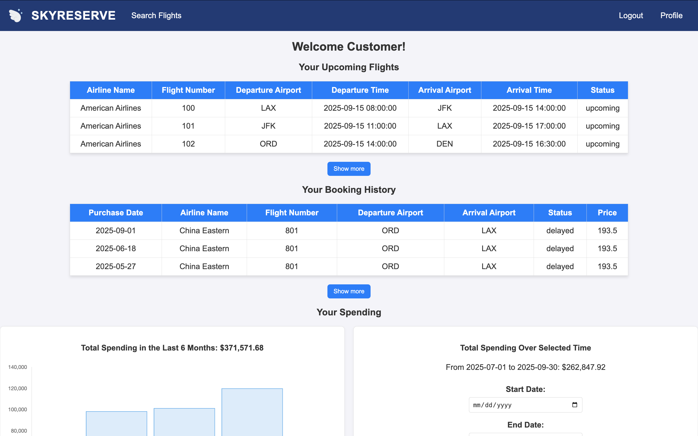
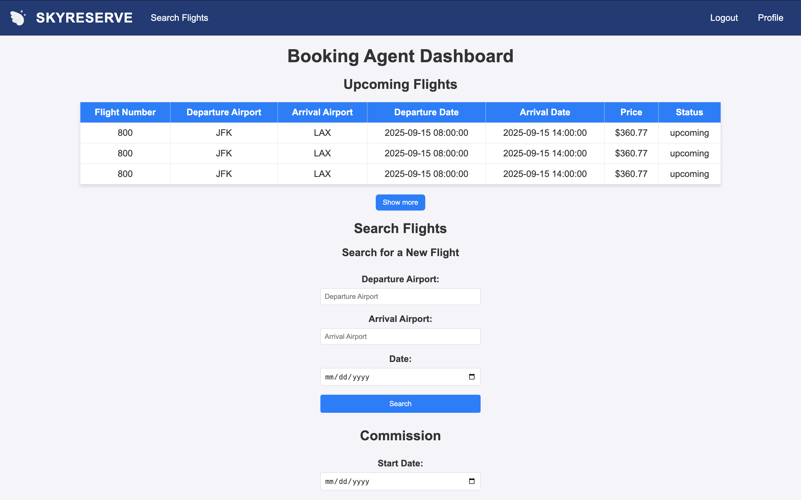
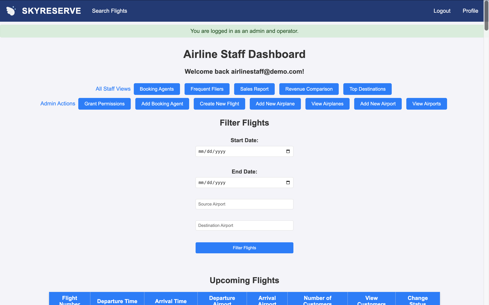

# SkyReserve

This project is a **full-stack web application** simulating a real-world airline ticket reservation system. Customers can search for flights, purchase tickets, track spending, and view dashboards, while airline staff and booking agents manage flights, airplanes, airports, and revenue reporting.  

## Quick Start
Demo Login on [Render](https://skyreserve-oepk.onrender.com/) (may take up to 30 seconds to load)
- Customer: customer@demo.com
- Booking Agent: booking@demo.com
- Staff Operator (China Eastern Airlines): operator@demo.com
- Staff Admin + Operator (American Airlines) : airlinestaff@demo.com
- Password: demo1234

---

## Technical Stack

- **Backend:** Python, Flask,  MySQL
- **Frontend:** HTML, CSS, JavaScript, Chart.js

---

## Features

### Homepage
- Guests can search and filter flights by date, origin, destination, and airline.
- Users can choose to login or sign-up as a customer, agent, or staff.


### Customer
- Purchase tickets and track personal spending.
- View interactive dashboards showing monthly and yearly spending.


### Booking Agent
- Purchase tickets on behalf of customers for their affiliated airline.
- View upcoming flights purchased for customers.
- Track commission earned from sales.


### Airline Admin / Staff
- Add and manage flights, airplanes, and airports.
- Access revenue comparison dashboards (direct vs indirect sales).
- View reports on ticket sales and customer activity.
- Role-based access control for all users.
- Monitor system-wide metrics and data integrity.


---

## Getting Started (Local Setup)

1. Clone the repository
```bash
git clone https://github.com/your-username/skyreserve.git
cd skyreserve
```

2. Use a clean venv (Python 3.12 recommended)
```bash
python3 -m venv venv
source venv/bin/activate
python -m pip install --upgrade pip setuptools wheel
python -m pip install -r requirements.txt
```

3. Build (or rebuild) the SQLite database
```bash
python init_sqlite.py
```

4. Start the app (debug server)
```bash
python app.py (or python3 app.py)
```

5. Reset the data anytime: rm -f instance/skyreserve.db && python init_sqlite.py

Use With XAMPP
1. Download XAMPP and start Apache and MySQL
2. Go to http://localhost/phpmyadmin and import the database
3. Download repository from github 
4. Run the following commands in the terminal